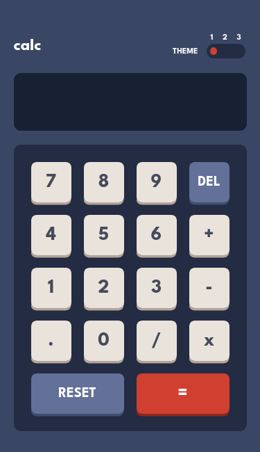

# Frontend Mentor - Calculator app solution

This is a solution to the [Calculator app challenge on Frontend Mentor](https://www.frontendmentor.io/challenges/calculator-app-9lteq5N29). Frontend Mentor challenges help you improve your coding skills by building realistic projects. 

## Table of contents

- [Overview](#overview)
  - [The challenge](#the-challenge)
  - [Screenshot](#screenshot)
  - [Links](#links)
- [My process](#my-process)
  - [Built with](#built-with)
  - [What I learned](#what-i-learned)
  - [Continued development](#continued-development)
  - [Useful resources](#useful-resources)
- [Author](#author)
- [Acknowledgments](#acknowledgments)

**Note: Delete this note and update the table of contents based on what sections you keep.**

## Overview

A project of a calculator web page with a beautiful design with 3 themes

### The challenge

Users should be able to:

- See the size of the elements adjust based on their device's screen size
- Perform mathmatical operations like addition, subtraction, multiplication, and division
- Adjust the color theme based on their preference
- **Bonus**: Have their initial theme preference checked using `prefers-color-scheme` and have any additional changes saved in the browser

### Screenshot





### Links

- Solution URL: [Repository](https://github.com/AllRedCat/calculator-app)
- Live Site URL: [Live site](https://allredcat.github.io/calculator-app/)

## My process

I inpruve my CSS skills and learn more about JavaScript

### Built with

- Semantic HTML5 markup
- CSS custom properties
- JavaScript

### What I learned

I learned more about some functions of JavaScript

```js
document.addEventListener('DOMContentLoaded', function () {
    const themeOptions = document.querySelectorAll('.theme-option');

    themeOptions.forEach(option => {
        option.addEventListener('click', function () {
            const selectedTheme = this.getAttribute('data-theme');
            document.documentElement.setAttribute('data-theme', selectedTheme);
        })
    })
})
```
```js
function appendToResult(value) {
    document.getElementById('result').value += value;
}

function calculateResult() {
    try {
        document.getElementById('result').value = eval(document.getElementById('result').value);
    } catch (error) {
        document.getElementById('result').value = 'Error';
    }
}

function clearResult() {
    document.getElementById('result').value = '';
}

function deleteLastCharacter() {
    var currentResult = document.getElementById('result').value;
    document.getElementById('result').value = currentResult.slice(0, -1);
}
```

### Continued development

I want to learn more about JavaScript and what this language can do 

## Author

- Website - [Gabriel | Red Cat](https://allredcat.github.io/Portfolio/)
- Frontend Mentor - [Gabriel Red](https://www.frontendmentor.io/profile/AllRedCat)
- Twitter - [Gabriel | Red Cat](https://twitter.com/GabrielRedCat)